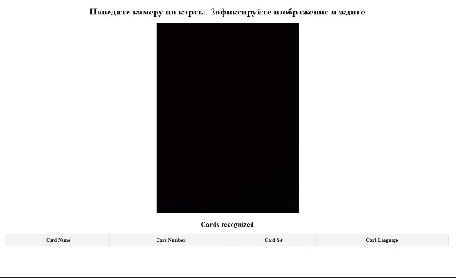
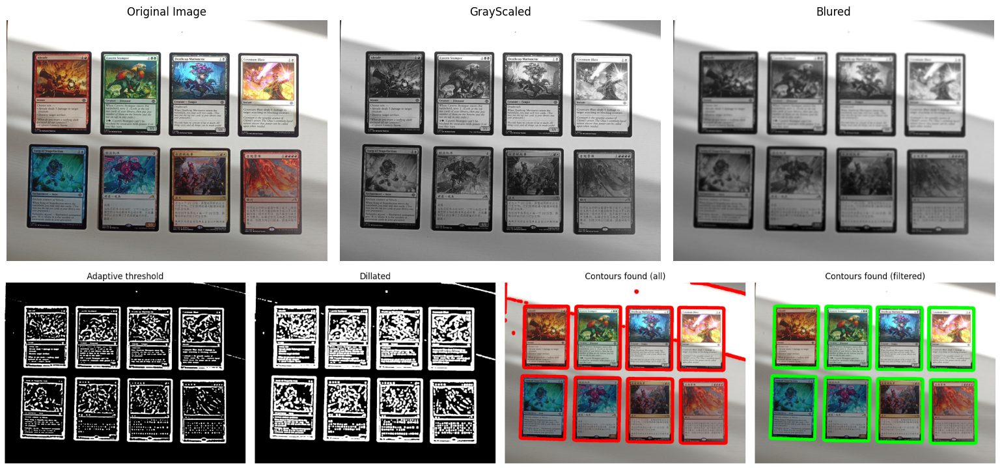
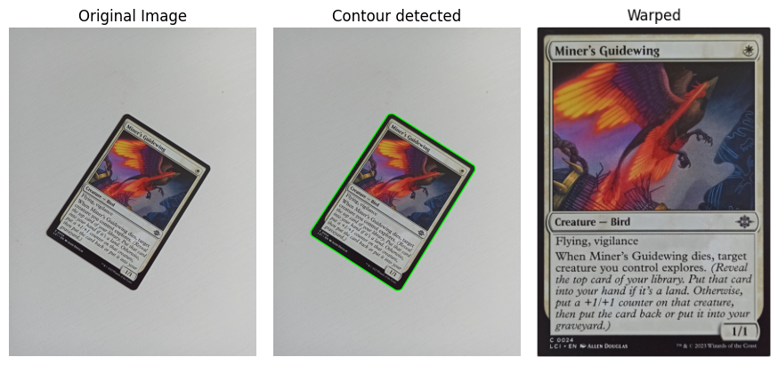

# MTG Cards Image Detection Based on Embedding Approach

## Project Motivation

<p float="center">


</p>

I was inspired to simplify the process of managing and cataloging my MTG cards for trading purposes. Manually updating my collection was time-consuming, so I decided to automate it. Instead of just digitizing my cards by hand, I wanted to develop a program that could recognize MTG cards directly from photos or video frames.

## Data files and usefull links

1) Pretrained model - [CLIP-VIT-LARGE](https://huggingface.co/openai/clip-vit-large-patch14)
2) Images for embedding creation - [Kaggle MTG image Dataset](https://www.kaggle.com/datasets/strangerone/mtg-multilang-images) 
3) HNSW Index for embeddings - [HNSW_Index](https://drive.google.com/file/d/1JWQZn68z7fdvxXt1bywYjJR3DsHPW3eU/view?usp=sharing) 
4) JSON for HNSW index embeddings - [HNSW json](https://drive.google.com/file/d/1F0FgjCM91Wei4LcLvc7R6TrG2_ZefeSF/view?usp=sharing)
5) [ScryFall API](https://scryfall.com/docs/api)

## Installation

Create python virtual environment
```bash 
python3 -m venv .env 
```
For Windows: 
```cmd 
.env\Scripts\activate
```
For Unix-based:
```bash 
source .env/bin/activate
``` 
Install all the necessary libraries
```bash 
pip install -r requirements.txt
```

## Running the Flask Application

To start the Flask-based solution:
1) Set Up Your Phone Camera Stream:
    - Install the IP Webcam app on your phone.
    - Start the stream in the app and note your IP address.
2) Run the Application using following flags:
    - ```-cip``` or ```--camera_ip``` for camera IP address.
    - ```-hnsw``` or ```--hnsw_folder``` for location of HNSW bin file and JSON metadata file.
    - Example usage: ```python application_flask/main.py -cip 192.168.0.101:8080 -hnsw data\embeddings```
3) Access the Application in Your Browser: Open your browser and go to "http://127.0.0.1:5000".

## Running inference in Jupyther 

To run experiments in the format of jupyther notebooks (offline) follow ```notebooks/...```

## Solution Outline 

This solution uses a combination of computer vision techniques and neural network embeddings, focusing on efficiency and minimal use of heavy neural networks to keep it lightweight. Here’s the process flow:

### Card Detection:

To detect cards within an image or video frame, we avoid neural networks by using classical computer vision techniques, which are lighter on resources.

We identify rectangular shapes, likely MTG cards, by converting images to grayscale, applying adaptive thresholding, and then detecting contours. The contours are filtered by size and shape to approximate the dimensions of a card, ensuring reliable detection in various lighting conditions. This process can be described as follows: 



### Perspective Correction:

Once a card is detected, we crop and warp the detected region to correct its perspective, preparing it for accurate recognition. The example of the result is: 


### Embedding Generation:

Using OpenAI’s model, we convert each detected card image into a 768-dimensional vector embedding, representing unique card features.
By generating embeddings for high-resolution scans of all cards, we can later use them as a reference database. You can find the dataset used for embedding creation in the [Data](#Data-files-and-usefull-links)

### Embedding Matching:

When a card is detected in an image or video, we match its embedding with the closest reference embedding using cosine similarity. This lets us recognize the card by finding its most similar counterpart in our database. We use the [Hierarchical Navigable Small World (HNSW)](https://arxiv.org/abs/1603.09320)algorithm to efficiently search for similar embeddings in a high-dimensional space. This allows us to match embeddings quickly without scanning the entire reference set.

### Video Integration (Online. Flask):

To ensure stable recognition, we track frames over a 20-frame window, checking for significant changes to determine if the camera is stationary. Once it stabilizes, we process the frame for recognition, avoiding redundant processing.

## Future Directions

1) Current contour-based recognition is optimized for cards on light backgrounds. Further tuning and experiments are ongoing to adapt to darker or busier backgrounds without introducing heavy neural network requirements, which would slow down processing.
2) Database Integration: I plan to connect a database for card storage, enabling automatic price fetching and potential trade setup.
3) Improving Metadata: Expanding metadata for each card will enhance recognition and cataloging capabilities.

## Release Notes 
04.11.2024: Fixed some bugs. Added argparse and a proxy test method for uploading recognized cards. 